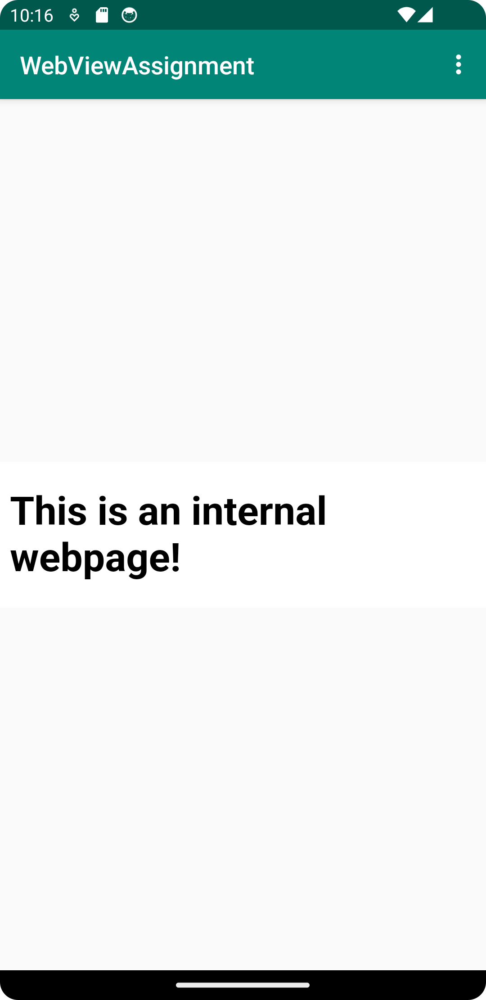
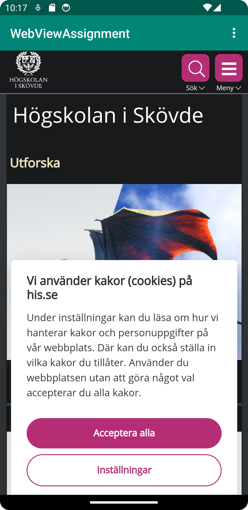

# Rapport


I detta program lär vi oss om webview, external och internal views. Samt hur man kan tillåta 
internet anslutning till appen. 
I denna report illustreras de punkterna med hjälp av skärmdump och några kodradder.

- **Koden för att tillåta internet anslutning, i AndroidManifest.xml:**
```
<manifest xmlns:android="http://schemas.android.com/apk/res/android"
    package="com.example.webviewapp">
    <uses-permission android:name="android.permission.INTERNET"/>
    
```
- **Functioner för att visa olika webviews, i MainActivity.java:**
```
public void showExternalWebPage(){
        // TODO: Add your code for showing external web page here
        myWebView.loadUrl("https://his.se");

    }

    public void showInternalWebPage(){
        // TODO: Add your code for showing internal web page here
        myWebView.loadUrl("file:///android_asset/about.html");
    }
@Override
    public boolean onOptionsItemSelected(MenuItem item) {
        // Handle action bar item clicks here. The action bar will
        // automatically handle clicks on the Home/Up button, so long
        // as you specify a parent activity in AndroidManifest.xml.
        int id = item.getItemId();

        //noinspection SimplifiableIfStatement
        if (id == R.id.action_external_web) {
            Log.d("==>","Will display external web page");
            showExternalWebPage();
            return true;
        }

        if (id == R.id.action_internal_web) {
            Log.d("==>","Will display internal web page");
            showInternalWebPage();
            return true;
        }

        return super.onOptionsItemSelected(item);
    }
```
Bilder:
- ## Internal webview:


